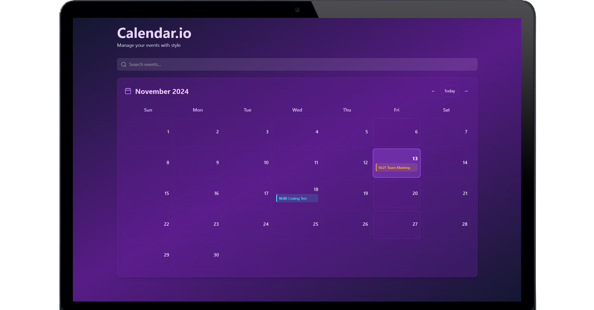

# ✨ Calendar.io | Calendar App



A stunning, feature-rich calendar application crafted with React, TypeScript, and Tailwind CSS. Experience seamless event management with an intuitive interface, smart notifications, and beautiful design.

<div align="center">

[](https://www.typescriptlang.org/)
[](https://reactjs.org/)
[](https://tailwindcss.com/)
[](https://github.com/pmndrs/zustand)

</div>

## 🌟 Key Features

- 🎯 **Intuitive Interface**
  - Seamless month navigation
  - Quick event creation
  - Drag-and-drop event management
  - Beautiful animations and transitions

- 📱 **Responsive Design**
  - Optimized for desktop, tablet, and mobile
  - Touch-friendly interactions
  - Adaptive layout for all screen sizes

- 🎨 **Rich Event Management**
  - Multiple event types (text, image, video)
  - Custom color coding
  - Recurring events support
  - Event reminders and notifications

- 🔔 **Smart Notifications**
  - Browser notifications
  - Customizable reminders
  - Snooze functionality
  - Priority-based alerts

## 🛠️ Tech Stack

<table>
  <tr>
    <td align="center" width="96">
        
      <br>React
    </td>
    <td align="center" width="96">
        
      <br>TypeScript
    </td>
    <td align="center" width="96">
        
      <br>Tailwind
    </td>
  </tr>
</table>

- ⚡ **Vite** - Lightning fast build tool
- 📦 **Zustand** - Simple state management
- 🎯 **React Hook Form** - Efficient form handling
- 📅 **date-fns** - Modern date utility library
- 🎨 **Lucide React** - Beautiful icons
- 🔄 **LocalStorage** - Persistent data storage

## 🚀 Quick Start

### Prerequisites

- Node.js 16+
- npm or yarn

### 💻 Live Preview
Project Live Link: [Calender.io](https://calender-io.vercel.app).


### Installation

```bash
# Clone the repository
git clone https://github.com/vipulkatwal/calendar.io

# Navigate to project directory
cd calendar.io

# Install dependencies
npm install

# Start development server
npm run dev

# 📱 Usage Guide

### Create an Event
1. Click any date cell in the calendar
2. Fill in event details in the modal:
   - Title and description
   - Date and time
   - Event type and color
3. Click **"Create Event"** to save

### Manage Events
- 📝 **Edit**: Click an existing event → modify → **Update**
- 🗑️ **Delete**: Open event → Click delete button
- 🔍 **Search**: Use the search bar for quick access
- 🔔 **Notifications**: Enable browser notifications for reminders

---

# 🤝 Contributing
We welcome contributions! Please follow these steps:

1. Fork the repository
2. Create your feature branch: `git checkout -b feature/AmazingFeature`
3. Commit your changes: `git commit -m 'Add some AmazingFeature'`
4. Push to the branch: `git push origin feature/AmazingFeature`
5. Open a Pull Request

---

# 📄 License
This project is licensed under the MIT License - see the LICENSE file for details.

---

# 🙏 Acknowledgments
- React - UI Framework
- Tailwind CSS - Styling
- Zustand - State Management
- date-fns - Date Utilities